# Ansible Refactoring Assignments & Imports

> __Jenkins job enhancement__
- Go to your Jenkins-Ansible server and create a new directory called ansible-config-artifact – we will store there all artifacts after each build.

```
sudo mkdir /home/ubuntu/ansible-config-artifact
```
- Change permissions to this directory, so Jenkins could save files there
```
chmod -R 0777 /home/ubuntu/ansible-config-artifact
```
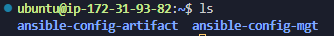

- Install the 'copy Artifact' plugin.

- Go to Jenkins web console -> Manage Jenkins -> Manage Plugins -> on Available tab search for Copy Artifact and install this plugin without restarting Jenkins

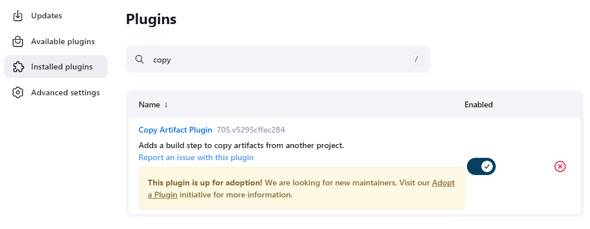

- Create a new Freestyle project and name it save_artifacts.

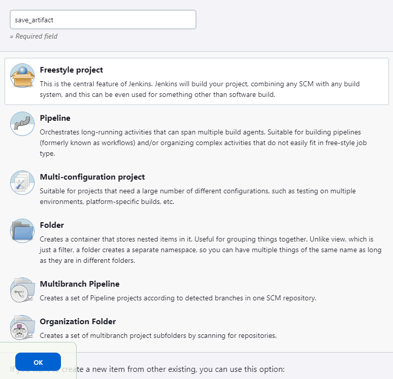

__Note:__ This project will be triggered by completion of your existing ansible project. Configure it accordingly:

__Note:__ You can configure number of builds to keep in order to save space on the server, for example, you might want to keep only last 2 or 5 build results. You can also make this change to your ansible job.

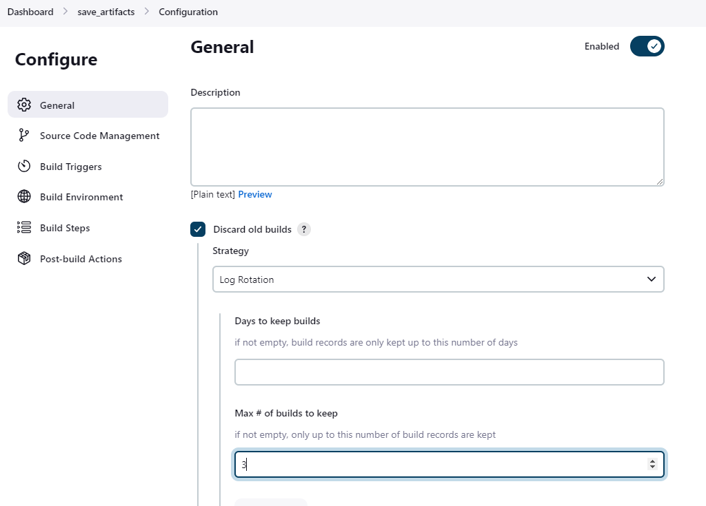

- The main idea of save_artifacts project is to save artifacts into /home/ubuntu/ansible-config-artifact directory. To achieve this

- Create a Build step and choose Copy artifacts from other project, specify ansible as a source project and /home/ubuntu/ansible-config-artifact as a target directory.
- Test your set up by making some change in README.MD file inside your ansible-config-mgt repository (right inside master branch).

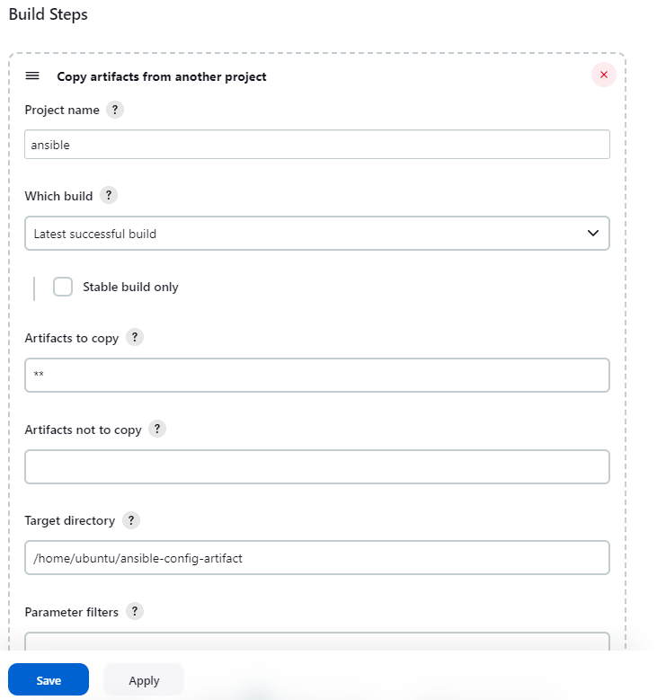

- If both Jenkins jobs have completed one after another – you shall see your files inside /home/ubuntu/ansible-config-artifact directory and it will be updated with every commit to your master/main branch.
- Now your Jenkins pipeline is more neat and clean.

> __Refactoring__
- Before starting to refactor the codes, ensure that you have pulled down the latest code from master (main) branch, and created a new branch, name it refactor.

- Within playbooks folder, create a new file and name it site.yml

- This file will now be considered as an entry point into the entire infrastructure configuration. Other playbooks will be included here as a reference. 

- In other words, site.yml will become a parent to all other playbooks that will be developed. Including common.yml that you created previously. 

- Create a new folder in root of the repository and name it static-assignments.

- The static-assignments folder is where all other children playbooks will be stored. 

- This is merely for easy organization of your work. It is not an Ansible specific concept, therefore you can choose how you want to organize your work. You will see why the folder name has a prefix of static very soon.

- Move common.yml file into the newly created static-assignments folder.

- Inside site.yml file, import common.yml playbook using the 'import_playbook' ansible module.
```
---
- hosts: all
- import_playbook: ../static-assignments/common.yml
```
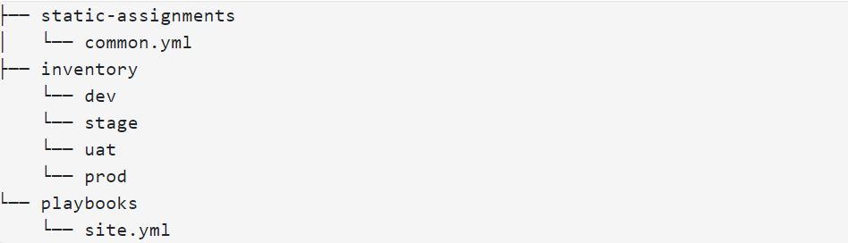

 - Run ansible-playbook command against the dev environment

   - You need to apply some tasks to your dev servers and wireshark is already installed
   - You can go ahead and create another playbook under static-assignments and name it `common-del.yml`. 
   - In this playbook, configure deletion of wireshark utility.


```yaml
---
- name: update web, nfs and db servers
  hosts: webservers, nfs, db
  remote_user: ec2-user
  become: yes
  become_user: root
  tasks:
  - name: delete wireshark
    yum:
      name: wireshark
      state: removed

- name: update LB server
  hosts: lb
  remote_user: ubuntu
  become: yes
  become_user: root
  tasks:
  - name: delete wireshark
    apt:
      name: wireshark-qt
      state: absent
      autoremove: yes
      purge: yes
      autoclean: yes
```

- Update site.yml with - import_playbook: `../static-assignments/common-del.yml` instead of `common.yml` and run it against dev servers:
```
cd /home/ubuntu/ansible-config-mgt/

ansible-playbook -i inventory/dev.yml playbooks/site.yaml
```

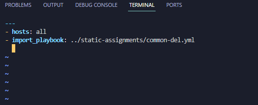

- Make sure that wireshark is deleted on all the servers by running wireshark --version

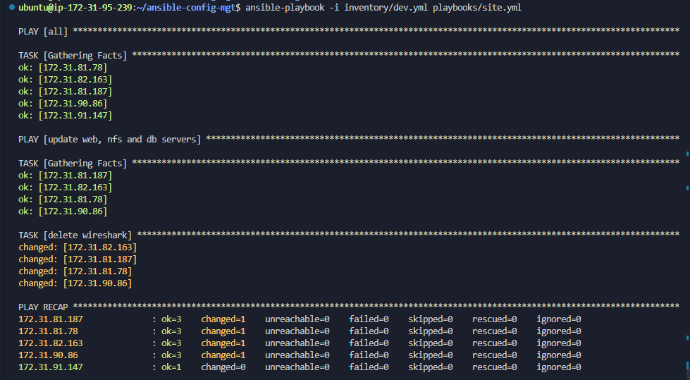

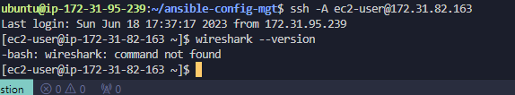

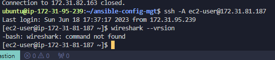

- Now you have learned how to use import_playbooks module and you have a ready solution to install/delete packages on multiple servers with just one command.

> Configure UAT Webservers with a role ‘Webserver’

- Launch 2 fresh EC2 instances using RHEL 8 image, we will use them as our uat servers, so give them names accordingly – Web1-UAT and Web2-UAT.

__Tip:__ Do not forget to stop EC2 instances that you are not using at the moment to avoid paying extra. For now, you only need 2 new RHEL 8 servers as Web Servers and 1 existing Jenkins-Ansible server up and running.

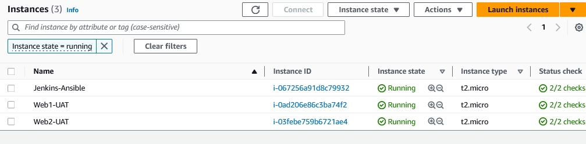

- To create a role, you must create a directory called roles/, relative to the playbook file or in `/etc/ansible/ directory.`

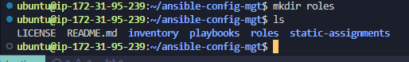
- __There are two ways how you can create this folder structure:__

1. Use an Ansible utility called ansible-galaxy inside `ansible-config-mgt/roles` directo-ry (you need to create roles directory upfront)

```
mkdir roles
cd roles
ansible-galaxy init webserver
```
2. Create the directory/files structure manually

__Note:__ You can choose either way, but since you store all your codes in GitHub, it is recommended to create folders and files there rather than locally on Jenkins-Ansible server.

- The entire folder structure should look like below, but if you create it manually
- You can skip creating tests, files, and vars or remove them if you used ansible-galaxy

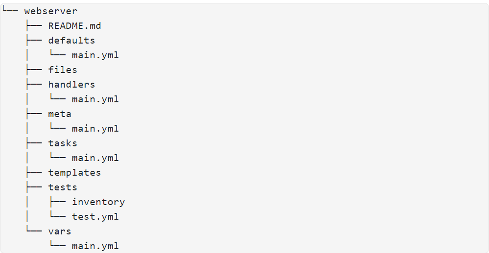
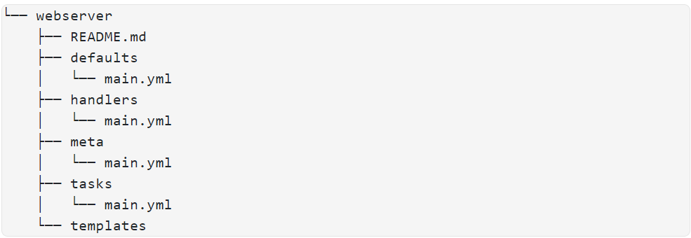

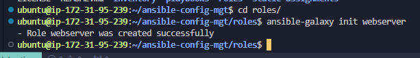


- Update your inventory `ansible-config-mgt/inventory/uat.yml` file with IP addresses of your 2 UAT Web servers.

__NOTE:__ Ensure you are using ssh-agent to ssh into the Jenkins-Ansible instance just as you have done in project 11;

```
[uat-webservers]
<Web1-UAT-Server-Private-IP-Address> ansible_ssh_user='ec2-user' 

<Web2-UAT-Server-Private-IP-Address> ansible_ssh_user='ec2-user' 
```
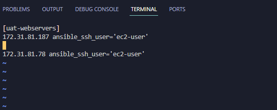


- In `/etc/ansible/ansible.cfg` file uncomment roles_path string and provide a full path to your roles directory `roles_path=/home/ubuntu/ansible-config-mgt/roles`, so Ansible could know where to find configured roles.

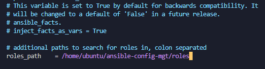

- It is time to start adding some logic to the webserver role. Go into tasks directory, and within the `main.yml` file, start writing configuration tasks to do the following:

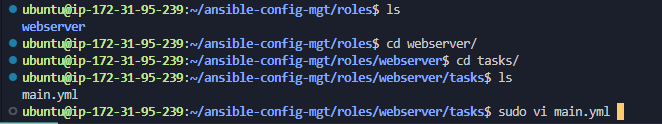

1. Install and configure Apache (httpd service)
2. Clone Tooling website from GitHub `https://github.com/<your-name>/tooling.git.`
3. Ensure the tooling website code is deployed to /`var/www/html` on each of 2 UAT Web servers.
4. Make sure httpd service is started

- Your main.yml may consist of following tasks:

```
---
- name: install apache
  become: true
  ansible.builtin.yum:
    name: "httpd"
    state: present

- name: install git
  become: true
  ansible.builtin.yum:
    name: "git"
    state: present

- name: clone a repo
  become: true
  ansible.builtin.git:
    repo: https://github.com/<your-name>/tooling.git
    dest: /var/www/html
    force: yes

- name: copy html content to one level up
  become: true
  command: cp -r /var/www/html/html/ /var/www/

- name: Start service httpd, if not started
  become: true
  ansible.builtin.service:
    name: httpd
    state: started

- name: recursively remove /var/www/html/html/ directory
  become: true
  ansible.builtin.file:
    path: /var/www/html/html
    state: absent
```
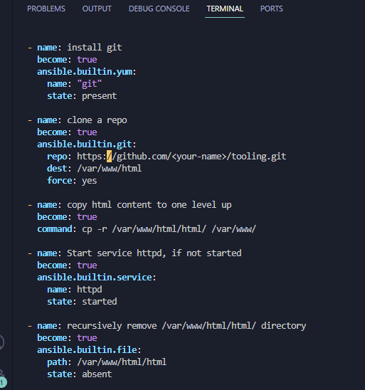

> Reference ‘Webserver’ role

- Within the `static-assignments` folder, create a new assignment for uat-webservers `uat-webservers.yml`. This is where you will reference the role.

```
---
- hosts: uat-webservers
  roles:
     - webserver
```
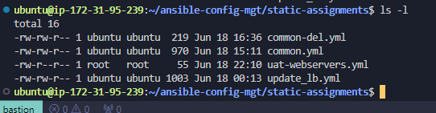

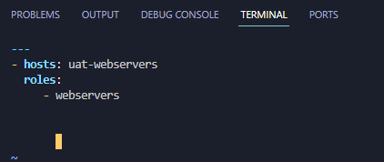

- Remember that the entry point to our ansible configuration is the `site.yml file`. Therefore, you need to refer your `uat-webservers.yml` role inside site.yml.

- So, we should have this in site.yml

```
---
- hosts: all
- import_playbook: ../static-assignments/common.yml

- hosts: uat-webservers
- import_playbook: ../static-assignments/uat-webservers.yml
```
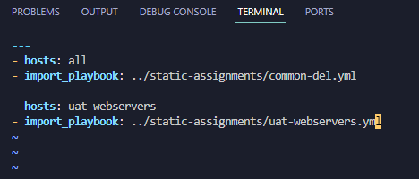

> Commit & Test

- Commit your changes, create a Pull Request and merge them to master branch

- Make sure webhook triggered two consequent Jenkins jobs, they ran successfully and copied all the files to your `Jenkins-Ansible server` into `/home/ubuntu/ansible-config-mgt/ directory`.

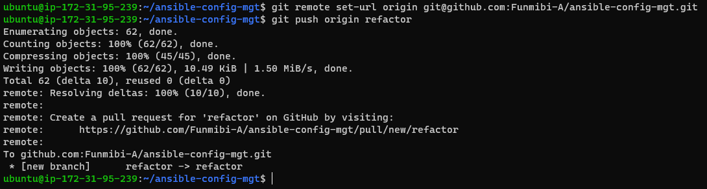

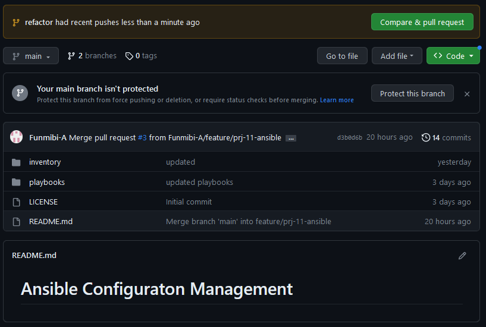


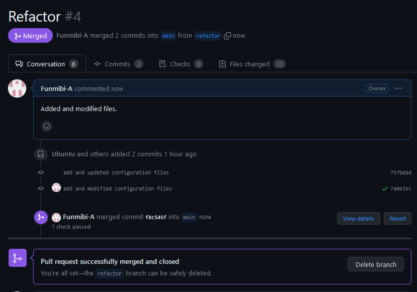

> Now run the playbook against your uat inventory and see what happens:

```
sudo ansible-playbook -i /home/ubuntu/ansible-config-mgt/inventory/uat.yml /home/ubuntu/ansible-config-mgt/playbooks/site.yaml
```
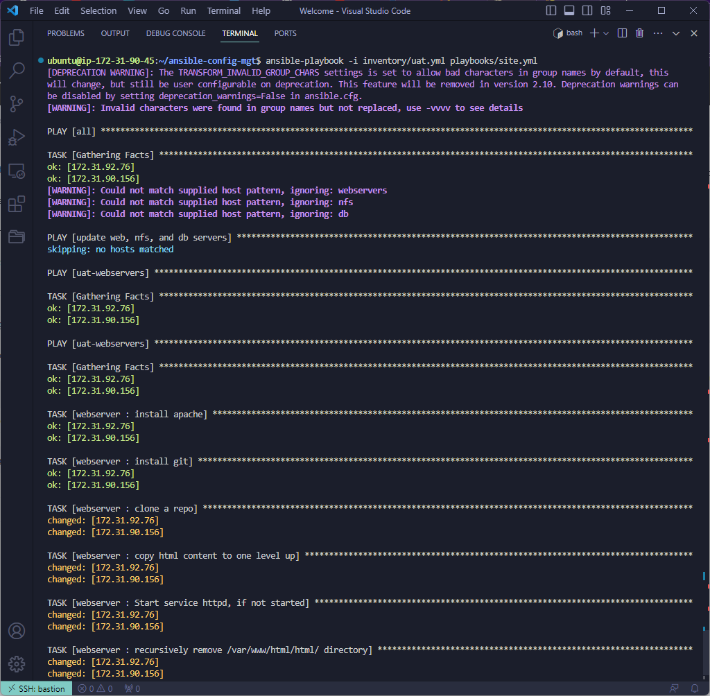
- You should be able to see both of your UAT Web servers configured and you can try to reach them from your browser:

```
http://<Web1-UAT-Server-Public-IP-or-Public-DNS-Name>/index.php

or

http://<Web1-UAT-Server-Public-IP-or-Public-DNS-Name>/index.php
```
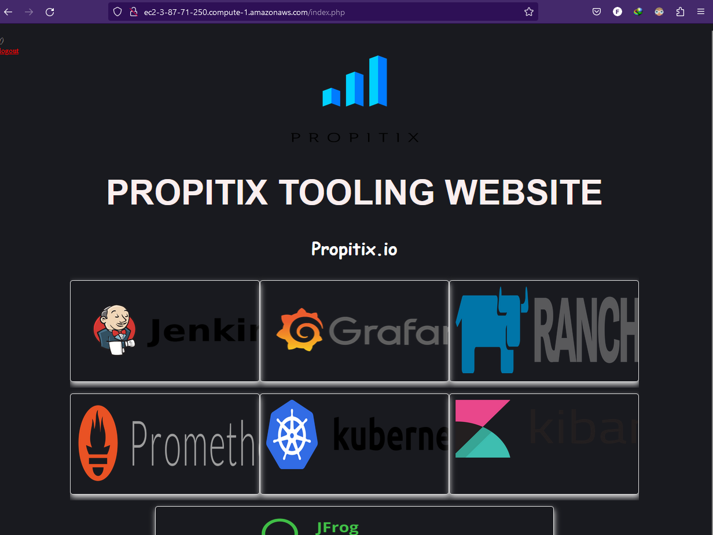


